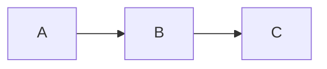

# md-view.nvim

Browser-based markdown preview for Neovim with live mermaid diagram rendering.

Opens a browser tab that renders your markdown buffer — including mermaid diagrams as SVG — and updates live as you type. Scroll sync keeps the browser viewport aligned with your cursor position.

## Features

- **Live preview** — browser updates within ~300ms of each edit
- **Mermaid diagrams** — fenced `mermaid` code blocks render as SVG
- **Syntax highlighting** — fenced code blocks highlighted via [highlight.js](https://highlightjs.org) with configurable themes
- **Scroll sync** — browser follows your cursor as you navigate the buffer
- **Zero dependencies** — pure Lua, no Node.js/Deno/external processes
- **Multi-buffer** — each buffer gets its own server on an auto-assigned port
- **Auto-cleanup** — servers shut down when buffers close or Neovim exits

## Requirements

- Neovim >= 0.8
- A web browser

## Installation

### [lazy.nvim](https://github.com/folke/lazy.nvim)

```lua
{ "karlcayme/md-view.nvim" }
```

### [packer.nvim](https://github.com/wbthomason/packer.nvim)

```lua
use("karlcayme/md-view.nvim")
```

## Configuration

```lua
require("md-view").setup({
  port = 0,
  host = "127.0.0.1",
  browser = nil,
  debounce_ms = 300,
  css = nil,
  highlight_theme = "vs2015",
  mermaid = {
    theme = "dark",
  },
})
```

Calling `setup()` is optional. All options have sensible defaults.

### Options

| Option | Type | Default | Description |
|--------|------|---------|-------------|
| `port` | `number` | `0` | Port for the local preview server. `0` lets the OS auto-assign a free port. |
| `host` | `string` | `"127.0.0.1"` | Bind address for the preview server. |
| `browser` | `string\|nil` | `nil` | Path to a browser executable. `nil` auto-detects (`open` on macOS, `xdg-open` on Linux, `cmd /c start` on Windows). |
| `debounce_ms` | `number` | `300` | Milliseconds to wait after the last edit before pushing an update to the browser. |
| `css` | `string\|nil` | `nil` | Custom CSS string injected into the preview page. Use this to override any default styles. |
| `highlight_theme` | `string` | `"vs2015"` | [highlight.js theme](https://highlightjs.org/demo) for syntax highlighting in fenced code blocks. See [Syntax Highlighting Themes](#syntax-highlighting-themes) for available options. |
| `mermaid.theme` | `string` | `"dark"` | Mermaid diagram theme. One of `"default"`, `"dark"`, `"forest"`, or `"neutral"`. |

### Syntax Highlighting Themes

Fenced code blocks with a language tag (e.g. ` ```lua `, ` ```python `) are syntax highlighted using [highlight.js](https://highlightjs.org). Set `highlight_theme` to any theme from the [highlight.js demo](https://highlightjs.org/demo).

Some popular dark themes:

| Theme | Description |
|-------|-------------|
| `"vs2015"` | Visual Studio 2015 dark (default) |
| `"github-dark"` | GitHub dark theme |
| `"github-dark-dimmed"` | GitHub dark dimmed |
| `"atom-one-dark"` | Atom One Dark |
| `"monokai"` | Monokai |
| `"dracula"` | Dracula |
| `"nord"` | Nord |
| `"tokyo-night-dark"` | Tokyo Night dark |
| `"catppuccin-mocha"` | Catppuccin Mocha |

Some popular light themes (pair with custom `css` to change the background):

| Theme | Description |
|-------|-------------|
| `"github"` | GitHub light |
| `"vs"` | Visual Studio light |
| `"atom-one-light"` | Atom One Light |
| `"catppuccin-latte"` | Catppuccin Latte |

Example:

```lua
require("md-view").setup({
  highlight_theme = "github-dark",
  mermaid = {
    theme = "dark",
  },
})
```

## Usage

### Commands

| Command         | Description                        |
|-----------------|------------------------------------|
| `:MdView`       | Open preview for the current buffer |
| `:MdViewStop`   | Stop the preview                   |
| `:MdViewToggle` | Toggle the preview on/off          |

### Keymaps

The plugin does not set any keymaps. Bind the commands yourself:

```lua
vim.keymap.set("n", "<leader>mp", "<cmd>MdViewToggle<cr>", { desc = "Toggle markdown preview" })
```

### Example

Given a markdown file with a mermaid block:

````markdown
# My Document

Some text here.


````

Running `:MdView` opens a browser tab with the rendered markdown and a live SVG diagram.

## Comparison

| | md-view.nvim | [markdown-preview.nvim](https://github.com/iamcco/markdown-preview.nvim) | [peek.nvim](https://github.com/toppair/peek.nvim) | [glow.nvim](https://github.com/ellisonleao/glow.nvim) | [render-markdown.nvim](https://github.com/MeanderingProgrammer/render-markdown.nvim) | [markview.nvim](https://github.com/OXY2DEV/markview.nvim) |
|---|---|---|---|---|---|---|
| **Runtime dependency** | None | Node.js + yarn | Deno | glow CLI (Go) | None | None |
| **Renders where** | Browser | Browser | Webview / Browser | Terminal float | Inline (extmarks) | Inline (extmarks) |
| **Mermaid diagrams** | Yes | Yes | Yes | No | No | No |
| **Live reload** | Yes | Yes | Yes | No | Yes | Yes |
| **Scroll sync** | Yes | Yes | Yes | No | N/A | Yes (splitview) |
| **Maintained** | Yes | Yes | Yes | Archived | Yes | Yes |

**Why md-view.nvim?**

- **No external runtime.** markdown-preview.nvim requires Node.js and yarn. peek.nvim requires Deno. glow.nvim requires a Go binary. md-view.nvim is pure Lua — it uses Neovim's built-in libuv TCP server and offloads rendering to the browser via CDN scripts. Nothing to install beyond the plugin itself.

- **Mermaid support without the weight.** The inline/extmark plugins (render-markdown.nvim, markview.nvim) are great for in-editor rendering but cannot draw diagrams. md-view.nvim gives you live mermaid SVGs alongside standard markdown, without the Node.js/Deno overhead of the other browser-based options.

- **Minimal scope.** md-view.nvim does one thing — open a browser preview with mermaid support — and keeps the codebase small enough to read in one sitting (~300 lines of Lua + an HTML template).

## How It Works

The plugin starts a local HTTP server (via Neovim's built-in libuv bindings) that serves an HTML page. The browser loads markdown-it, mermaid.js, and morphdom from CDN. Buffer changes are pushed to the browser over Server-Sent Events (SSE), where JavaScript re-renders the markdown and patches the DOM.

See [ARCHITECTURE.md](ARCHITECTURE.md) for the full technical design.

## License

[MIT](LICENSE)
