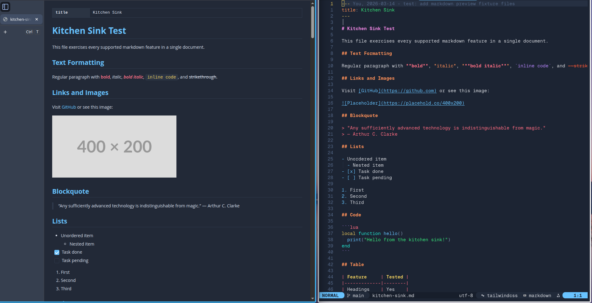
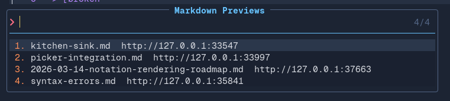
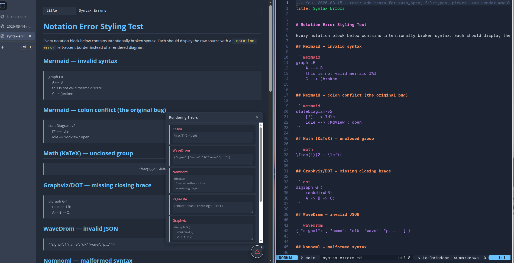
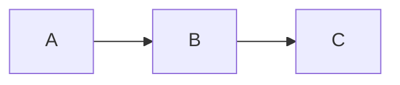

# md-view.nvim

Browser-based markdown preview for Neovim with live mermaid diagram rendering.

Opens a browser tab that renders your markdown buffer — including mermaid diagrams as SVG — and updates live as you type. Scroll sync keeps the browser viewport aligned with your cursor position.




## Why another markdown preview plugin?

I heavily use mermaid diagrams in my markdown files. The in-editor previewers I tried don't render them,
and the browser-based ones that do (like markdown-preview.nvim) need Node.js or Deno
installed. I wanted something that's lightweight and just works out of the box — no runtime, no setup.

- **Mermaid out of the box** — most previewers can't render mermaid diagrams at all.
  The ones that can need a Node.js or Deno runtime. This one just loads mermaid.js from
  CDN and gets out of the way.

- **Zero dependencies** — no Node.js, no Deno, no external binaries. Pure Lua, all
  rendering delegated to the browser via CDN. (`curl` is optionally required for
  one-time offline asset fetching via `:MdViewFetchAssets`.)

- **Preview picker** — I often have multiple markdown files open at the same time.
  `:MdViewList` lets me see and jump between all active previews without digging through
  buffers.

  

- **Error feedback** — when I mess up a diagram's syntax, mermaid.js shows an inline
  error in the browser right away. Fast feedback loop for iterating on diagrams.

  

## Features

- **Live preview** — browser updates within ~300ms of each edit
- **Mermaid diagrams** — fenced `mermaid` code blocks render as SVG
- **Syntax highlighting** — fenced code blocks highlighted via [highlight.js](https://highlightjs.org) with configurable themes
- **Scroll sync** — browser follows your cursor as you navigate the buffer
- **Zero dependencies** — pure Lua, no Node.js/Deno/external processes (`curl` optional for offline asset fetch)
- **Multi-buffer** — each buffer gets its own server on an auto-assigned port
- **Auto-cleanup** — servers shut down when buffers close or Neovim exits

## Requirements

- Neovim >= 0.8
- A web browser

## Installation

### [lazy.nvim](https://github.com/folke/lazy.nvim)

```lua
{ "kcayme/md-view.nvim" }
```

### [packer.nvim](https://github.com/wbthomason/packer.nvim)

```lua
use("kcayme/md-view.nvim")
```

## Configuration

```lua
require("md-view").setup({
  -- Port for the local preview server. 0 = auto-assign a free port.
  port = 0,
  -- Bind address. Must be a loopback address (127.0.0.1, ::1, localhost).
  host = "127.0.0.1",
  -- Browser executable. nil = auto-detect (open/xdg-open/cmd /c start).
  browser = nil,
  -- Milliseconds to debounce buffer updates before pushing to the browser.
  debounce_ms = 300,
  -- Custom CSS string injected into the preview page.
  css = nil,
  -- Auto-close the browser tab when the preview is stopped.
  auto_close = true,
  -- When true, always opens a new browser tab when switching to a buffer that
  -- already has an active preview (via :MdView or auto_open). This ensures the
  -- browser always shows the preview for the current buffer, at the cost of
  -- breaking any split-tab arrangement in the browser.
  follow_focus = false,
  -- Scroll sync method. "percentage" syncs by proportional scroll offset.
  -- "cursor" anchors to the nearest source line in the preview DOM.
  scroll = {
    method = "percentage",  -- "percentage" | "cursor"
  },
  -- Color theme for the preview page.
  theme = {
    -- One of: "auto", "dark", "light", "sync"
    -- "auto" follows Neovim's background setting; "sync" mirrors your colorscheme live.
    mode = "auto",
    -- highlight.js theme for fenced code blocks. See Syntax Highlighting Themes below.
    -- nil auto-selects: "vs2015" for dark themes, "github" for light themes.
    syntax = nil,
    -- Highlight group overrides for CSS variable extraction (only used when mode = "sync").
    highlights = {},
  },
  notations = {
    -- Each notation has an `enable` field (default true) and optional config.
    -- Set enable = false to skip loading the library (saves bandwidth).
    mermaid  = { enable = true, theme = nil },  -- nil = auto-chosen per theme
    katex    = { enable = true },   -- math fences and $...$ / $$...$$ inline math
    graphviz = { enable = true },   -- dot / graphviz fences
    wavedrom = { enable = true },   -- wavedrom fences
    nomnoml  = { enable = true },   -- nomnoml fences
    abc      = { enable = true },   -- abc music notation fences
    vegalite = { enable = true },   -- vega-lite fences
  },
  -- Filetypes this plugin will preview. Running :MdView on a buffer whose
  -- filetype is not in this list emits a warning and does nothing.
  -- Set to {} to allow any filetype.
  filetypes = { "markdown" },
  -- Automatically open (or re-focus) a preview whenever you enter a qualifying
  -- buffer. Opt-in; disabled by default.
  auto_open = {
    enable = false,
    -- Neovim events that trigger the auto-open check.
    events = { "BufWinEnter" },
  },
  -- Customise the :MdViewList picker (vim.ui.select).
  -- Works with any vim.ui.select replacement (Telescope, fzf-lua, snacks, dressing.nvim, etc.).
  picker = {
    -- Title/prompt shown at the top of the picker.
    prompt = "Markdown Previews",
    -- Custom item formatter. function(item) → string.
    -- item has: .bufnr, .port, .name (basename of the file).
    -- nil uses the built-in "name  http://host:port" format.
    format_item = nil,
    -- Hint passed as opts.kind to vim.ui.select. Some pickers use this
    -- to provide a specialised UI (e.g. a file-preview pane).
    kind = nil,
  },
  -- Single-page mode: all active previews share one browser tab.
  -- The mux server uses the top-level `port` option (0 = OS-assigned).
  single_page = {
    enable = false,
    -- How to label each preview's tab in the hub page.
    -- "filename"  — basename only (e.g. "README.md")
    -- "relative"  — path relative to cwd (e.g. "docs/README.md")
    -- "parent"    — parent dir + basename (e.g. "docs/README.md")
    -- function(ctx) — custom label; ctx = { bufnr, filename, path }
    tab_label = "parent",
  },
})
```

Calling `setup()` is optional. All options have sensible defaults.

### Options

| Option | Type | Default | Description |
|--------|------|---------|-------------|
| `port` | `number` | `0` | Port for the local preview server. `0` lets the OS auto-assign a free port. |
| `host` | `string` | `"127.0.0.1"` | Bind address for the preview server. |
| `browser` | `string\|nil` | `nil` | Path to a browser executable. `nil` auto-detects (`open` on macOS, `xdg-open` on Linux, `cmd /c start` on Windows). |
| `debounce_ms` | `number` | `300` | Milliseconds to wait after the last edit before pushing an update to the browser. |
| `scroll.method` | `string` | `"percentage"` | Scroll sync algorithm. `"percentage"` keeps the browser at the same proportional offset as the cursor. `"cursor"` anchors the browser to the nearest source line in the rendered DOM. |
| `css` | `string\|nil` | `nil` | Custom CSS string injected into the preview page. Use this to override any default styles. |
| `theme.mode` | `string` | `"auto"` | Color theme for the preview page. `"auto"` follows Neovim's `background` setting; `"dark"` / `"light"` force a palette; `"sync"` mirrors your current colorscheme live (see [Neovim Colorscheme Sync](#neovim-colorscheme-sync)). |
| `theme.syntax` | `string\|nil` | `nil` | [highlight.js theme](https://highlightjs.org/demo) for syntax highlighting in fenced code blocks. `nil` auto-selects based on `theme.mode`: dark themes use `"vs2015"`, light themes use `"github"`. See [Syntax Highlighting Themes](#syntax-highlighting-themes) for available options. |
| `theme.highlights` | `table` | `{}` | Highlight group overrides for CSS variable extraction. Only used when `theme.mode = "sync"`. See [Neovim Colorscheme Sync](#neovim-colorscheme-sync). |
| `notations` | `table` | see above | Per-notation configuration. Each notation is `{ enable = true, ...options }`. Set `enable = false` to skip loading the CDN library. |
| `notations.mermaid.theme` | `string\|nil` | `nil` | Mermaid diagram theme. One of `"default"`, `"dark"`, `"forest"`, `"neutral"`, or `"base"`. `nil` auto-chooses based on `theme.mode`. |
| `filetypes` | `string[]` | `{ "markdown" }` | List of buffer filetypes the plugin will preview. Running `:MdView` on a buffer whose filetype is not in the list emits a warning and does nothing. Set to `{}` to allow any filetype. |
| `auto_close` | `boolean` | `true` | Auto-close the browser tab when the preview is stopped. |
| `follow_focus` | `boolean` | `false` | When `true`, always opens a new browser tab when revisiting a buffer that already has an active preview (via `:MdView` or `auto_open`). Ensures the browser always shows the preview for the current buffer. **Note:** opens a new tab each time, closing the existing one via the tab-dedup mechanism — any split-tab arrangement in the browser will break. |
| `auto_open.enable` | `boolean` | `false` | When `true`, automatically opens (or re-focuses) a preview whenever you enter a qualifying buffer. The filetype must still be in `filetypes`. Toggle at runtime with `:MdViewAutoOpen`. |
| `auto_open.events` | `string[]` | `{ "BufWinEnter" }` | Neovim autocmd events that trigger the auto-open check. Replace with e.g. `{ "BufEnter" }` if you prefer a different event. |
| `picker.prompt` | `string` | `"Markdown Previews"` | Title/prompt shown at the top of the `:MdViewList` picker. |
| `picker.format_item` | `function\|nil` | `nil` | `function(item) → string`. `item` has `.bufnr`, `.port`, `.name` (basename). `nil` uses the built-in `"name  http://host:port"` format. |
| `picker.kind` | `string\|nil` | `nil` | Hint passed as `opts.kind` to `vim.ui.select`. Some picker replacements use this to provide a specialised UI (e.g. a file-preview pane). |
| `single_page.enable` | `boolean` | `false` | When `true`, all active previews are multiplexed into one browser tab via a shared hub server. The hub uses the top-level `port` option for its address. |
| `single_page.tab_label` | `string\|function` | `"parent"` | Label shown on each preview's tab in the hub. `"filename"` — basename; `"relative"` — path relative to cwd; `"parent"` — parent dir + basename; `function(ctx) → string` for a fully custom label (`ctx` has `.bufnr`, `.filename`, `.path`). |

Examples:

```lua
-- Allow markdown and MDX buffers (replaces the default list)
require("md-view").setup({
  filetypes = { "markdown", "mdx" },
})

-- Allow any filetype (no restriction)
require("md-view").setup({
  filetypes = {},
})

-- Auto-open a preview whenever you enter a markdown buffer
require("md-view").setup({
  auto_open = { enable = true },
})

-- Auto-open on BufEnter instead of BufWinEnter
require("md-view").setup({
  auto_open = { enable = true, events = { "BufEnter" } },
})

-- Customise the :MdViewList picker title
require("md-view").setup({
  picker = { prompt = "My Previews" },
})

-- Show only the buffer name (no URL) in the picker
require("md-view").setup({
  picker = {
    format_item = function(item)
      return item.name
    end,
  },
})
```

> **Picker integrations:** See [`docs/recipes/picker-integration.md`](docs/recipes/picker-integration.md) for setup guides covering dressing.nvim, Telescope, fzf-lua, snacks.nvim, and mini.pick.

> **lazy.nvim users:** `auto_open` requires the plugin to load at startup so it can register its autocmd. If your spec uses `cmd = {...}` the plugin won't load until a command is invoked and auto-open will never fire. Either set `lazy = false`, or add the trigger event to your spec:
>
> ```lua
> {
>   "kcayme/md-view.nvim",
>   lazy = false,
>   opts = { auto_open = { enable = true } },
> }
> ```
>
> Or, to keep command-based lazy-loading while still supporting auto-open:
>
> ```lua
> {
>   "kcayme/md-view.nvim",
>   cmd   = { "MdView", "MdViewStop", "MdViewToggle", "MdViewAutoOpen" },
>   event = { "BufWinEnter" },
>   opts  = { auto_open = { enable = true } },
> }
> ```

### Syntax Highlighting Themes

Fenced code blocks with a language tag (e.g. ` ```lua `, ` ```python `) are syntax highlighted using [highlight.js](https://highlightjs.org). Set `theme.syntax` to any theme from the [highlight.js demo](https://highlightjs.org/demo).

Some popular dark themes:

| Theme | Description |
|-------|-------------|
| `"vs2015"` | Visual Studio 2015 dark (auto-selected for dark themes) |
| `"github-dark"` | GitHub dark theme |
| `"github-dark-dimmed"` | GitHub dark dimmed |
| `"atom-one-dark"` | Atom One Dark |
| `"monokai"` | Monokai |
| `"dracula"` | Dracula |
| `"nord"` | Nord |
| `"tokyo-night-dark"` | Tokyo Night dark |
| `"catppuccin-mocha"` | Catppuccin Mocha |

Some popular light themes (pair with custom `css` to change the background):

| Theme | Description |
|-------|-------------|
| `"github"` | GitHub light |
| `"vs"` | Visual Studio light |
| `"atom-one-light"` | Atom One Light |
| `"catppuccin-latte"` | Catppuccin Latte |

Example:

```lua
require("md-view").setup({
  theme = { syntax = "github-dark" },
  notations = {
    mermaid = { theme = "dark" },
  },
})
```

### Custom CSS

The `css` option injects a raw CSS string into the preview page's `<style>` block, after all built-in styles. Use it to override layout, typography, or colors.

The page uses CSS custom properties for theming. Override these to restyle any element without fighting specificity:

| Variable | Controls |
|----------|---------|
| `--md-bg` | Page background |
| `--md-fg` | Body text color |
| `--md-heading` | Heading color |
| `--md-link` | Link color |
| `--md-code-fg` | Inline code text |
| `--md-code-bg` | Inline code and code block background |
| `--md-border` | Borders, `<hr>`, table lines |
| `--md-muted` | Dimmed text (e.g. `h6`) |

**Wider content area** (default `max-width` is `882px`):

```lua
require("md-view").setup({
  css = "body { max-width: 1100px; }",
})
```

**Custom font and larger base size:**

```lua
require("md-view").setup({
  css = [[
    body {
      font-family: "Georgia", serif;
      font-size: 16px;
      line-height: 1.8;
    }
  ]],
})
```

**Light theme with a warm background** (pair with a light syntax theme):

```lua
require("md-view").setup({
  theme = { mode = "light", syntax = "github" },
  css = [[
    :root {
      --md-bg: #faf8f5;
      --md-code-bg: #f0ede8;
    }
  ]],
})
```

**Full-width, no side padding** (useful on wide monitors):

```lua
require("md-view").setup({
  css = "body { max-width: none; padding: 0 48px; }",
})
```

### Neovim Colorscheme Sync

Set `theme.mode = "sync"` to mirror your current Neovim colorscheme in the preview. Colors are extracted from Neovim highlight groups and pushed to the browser via SSE on every `ColorScheme` event — no page reload needed.

```lua
require("md-view").setup({ theme = { mode = "sync" } })
```


Use `theme.highlights` to customize which highlight groups are sampled per CSS variable:

```lua
require("md-view").setup({
  theme = {
    mode    = "sync",
    highlights = {
      heading = "@markup.heading",
      link    = { "MyLink", "Underlined" },
    },
  },
})
```

`theme.highlights` has no effect when `theme.mode` is not `"sync"`.

### Notation Support

md-view.nvim renders notation languages embedded in markdown code fences. All notations are enabled by default and loaded via CDN — disable any to skip loading its library.

| Notation | Fence Language | Status |
|----------|---------------|--------|
| Mermaid  | `mermaid`     | Built-in |
| KaTeX    | `math` / `$...$` / `$$...$$` | Built-in |
| Graphviz | `dot`, `graphviz` | Built-in |
| WaveDrom | `wavedrom` | Built-in |
| Nomnoml  | `nomnoml` | Built-in |
| abcjs    | `abc` | Built-in |
| Vega-Lite | `vega-lite` | Built-in |

To disable a notation:

```lua
require("md-view").setup({
  notations = {
    katex = { enable = false }, -- skip loading KaTeX (~280 KB)
  },
})
```

To set a mermaid diagram theme:

```lua
require("md-view").setup({
  notations = {
    mermaid = { theme = "forest" },
  },
})
```

## Offline Support

md-view.nvim can work offline by caching vendor assets locally. This is useful when developing without internet access or for reproducible deployments.

### Auto-fetch on setup

`setup()` automatically fetches vendor assets the first time it runs (i.e. when the vendor directory doesn't exist yet). You'll see a notification immediately:

```
[md-view] Fetching vendor assets for offline use...
```

followed by a completion notification once all downloads finish. The fetch is non-blocking — setup completes immediately and the downloads happen in the background.

The 18 vendor libraries (markdown-it, mermaid, highlight.js, KaTeX, graphviz, wavedrom, nomnoml, abcjs, vega-lite, and their dependencies) are saved to `~/.local/share/nvim/md-view.nvim/vendor/`. The plugin automatically detects this directory and uses the cached assets instead of loading from CDN. If the vendor directory is missing or incomplete, it falls back to CDN.

### Re-fetching assets

Run `:MdViewFetchAssets` anytime to re-download the cached assets — for example after a partial failure, or to update to the latest versions.

To specify a custom highlight.js theme for the cached CSS:

```vim
:MdViewFetchAssets highlight_theme=github-dark
```

## Usage

### Commands

| Command                  | Description                                      |
|--------------------------|--------------------------------------------------|
| `:MdView`                | Open preview for the current buffer              |
| `:MdViewStop`            | Stop the preview                                 |
| `:MdViewToggle`          | Toggle the preview on/off                        |
| `:MdViewList`            | Pick from all active previews                    |
| `:MdViewAutoOpen`        | Toggle automatic preview on buffer enter on/off  |
| `:MdViewFetchAssets`     | Re-fetch vendor assets for offline use           |

### Keymaps

The plugin does not set any keymaps. Bind the commands yourself:

```lua
vim.keymap.set("n", "<leader>mp", "<cmd>MdViewToggle<cr>", { desc = "Toggle markdown preview" })
```

### Example

Given a markdown file with a mermaid block:

````markdown
# My Document

Some text here.


````

Running `:MdView` opens a browser tab with the rendered markdown and a live SVG diagram.

## Comparison

| | md-view.nvim | [markdown-preview.nvim](https://github.com/iamcco/markdown-preview.nvim) | [peek.nvim](https://github.com/toppair/peek.nvim) | [glow.nvim](https://github.com/ellisonleao/glow.nvim) | [render-markdown.nvim](https://github.com/MeanderingProgrammer/render-markdown.nvim) | [markview.nvim](https://github.com/OXY2DEV/markview.nvim) |
|---|---|---|---|---|---|---|
| **Runtime dependency** | None (curl optional) | Node.js + yarn | Deno | glow CLI (Go) | None | None |
| **Renders where** | Browser | Browser | Webview / Browser | Terminal float | Inline (extmarks) | Inline (extmarks) |
| **Mermaid diagrams** | Yes | Yes | Yes | No | No | No |
| **Notation support** | Mermaid, KaTeX, Graphviz, WaveDrom, Nomnoml, ABC, Vega-Lite | Mermaid | Mermaid | None | None | None |
| **Live reload** | Yes | Yes | Yes | No | Yes | Yes |
| **Scroll sync** | Yes | Yes | Yes | No | N/A | Yes (splitview) |
| **Maintained** | Yes | Yes | Yes | Archived | Yes | Yes |

**Why md-view.nvim?**

- **No external runtime.** markdown-preview.nvim requires Node.js and yarn. peek.nvim requires Deno. glow.nvim requires a Go binary. md-view.nvim is pure Lua — it uses Neovim's built-in libuv TCP server and offloads rendering to the browser via CDN scripts. Nothing to install beyond the plugin itself.

- **Mermaid support without the weight.** The inline/extmark plugins (render-markdown.nvim, markview.nvim) are great for in-editor rendering but cannot draw diagrams. md-view.nvim gives you live mermaid SVGs alongside standard markdown, without the Node.js/Deno overhead of the other browser-based options.

- **Broad notation support without the runtime.** Beyond mermaid, md-view.nvim renders KaTeX math, Graphviz, WaveDrom, Nomnoml, ABC notation, and Vega-Lite charts — all via CDN, no extra installs. The other browser-based options stop at mermaid.

## How It Works

The plugin starts a local HTTP server (via Neovim's built-in libuv bindings) that serves an HTML page. The browser loads markdown-it, mermaid.js, and morphdom from CDN. Buffer changes are pushed to the browser over Server-Sent Events (SSE), where JavaScript re-renders the markdown and patches the DOM.

See [ARCHITECTURE.md](ARCHITECTURE.md) for the full technical design.

## License

[MIT](LICENSE)
