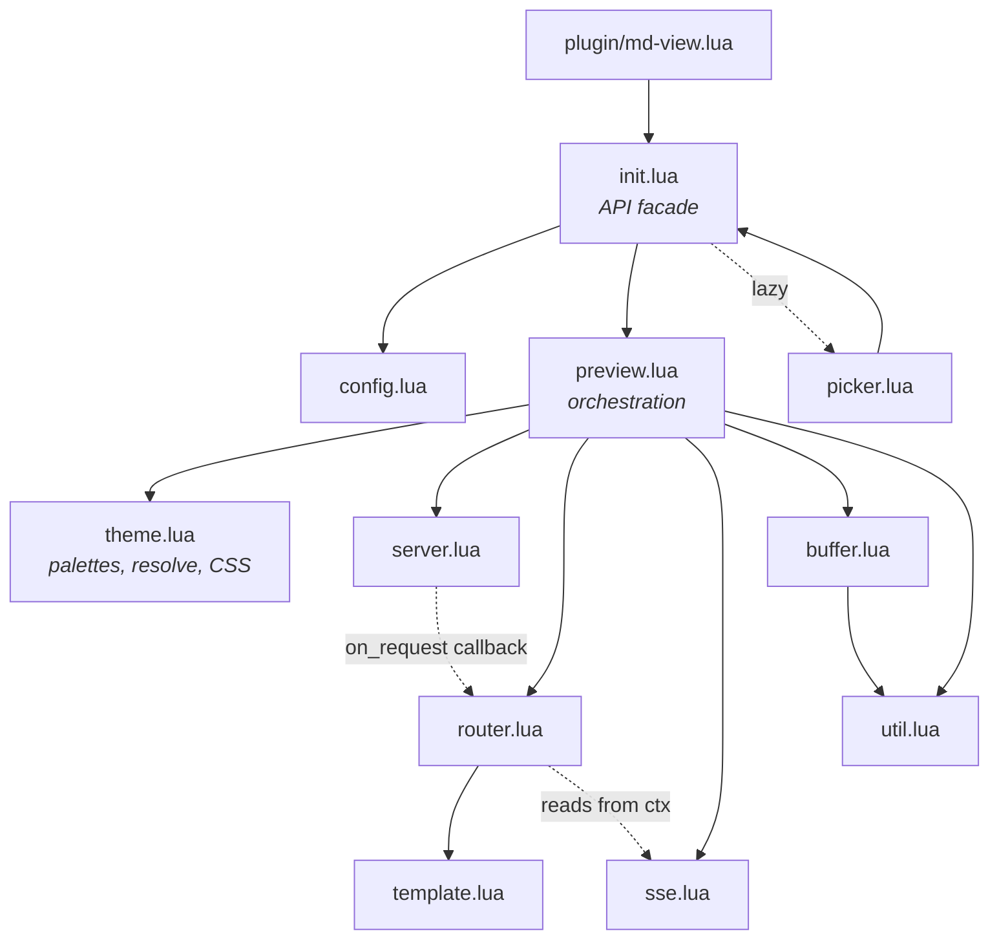
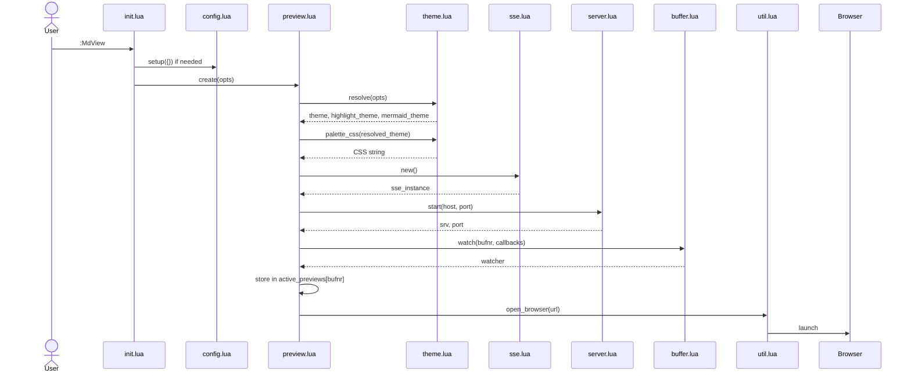
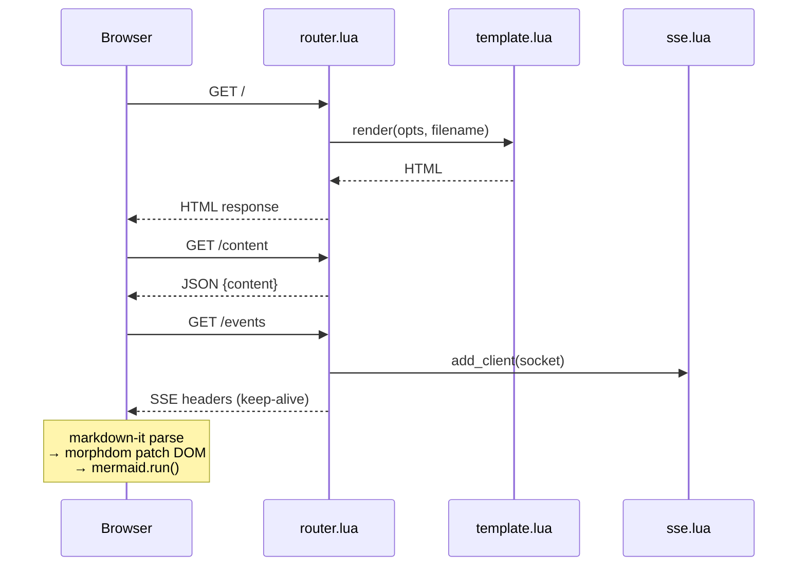
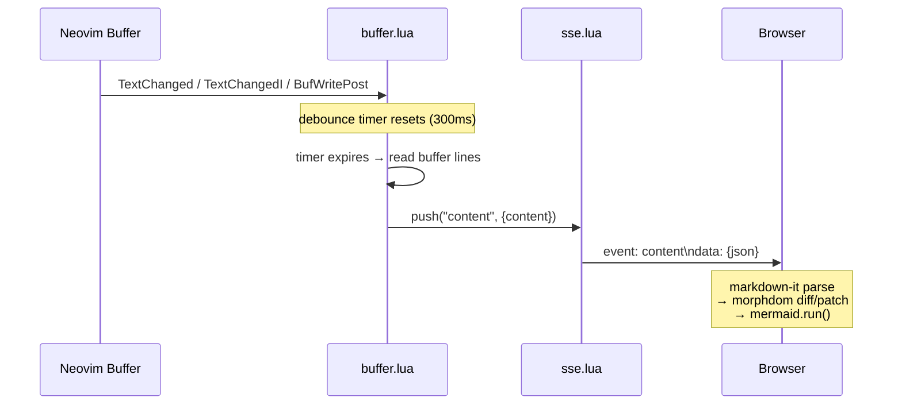
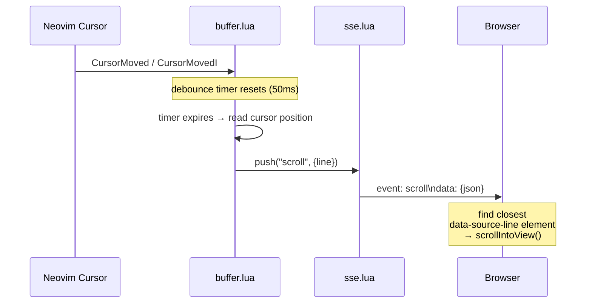
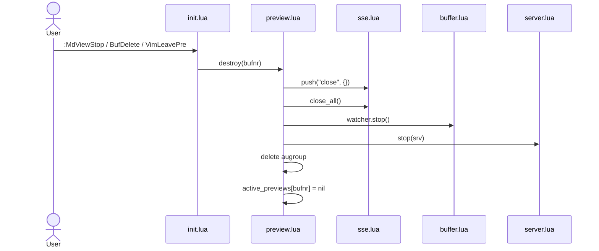
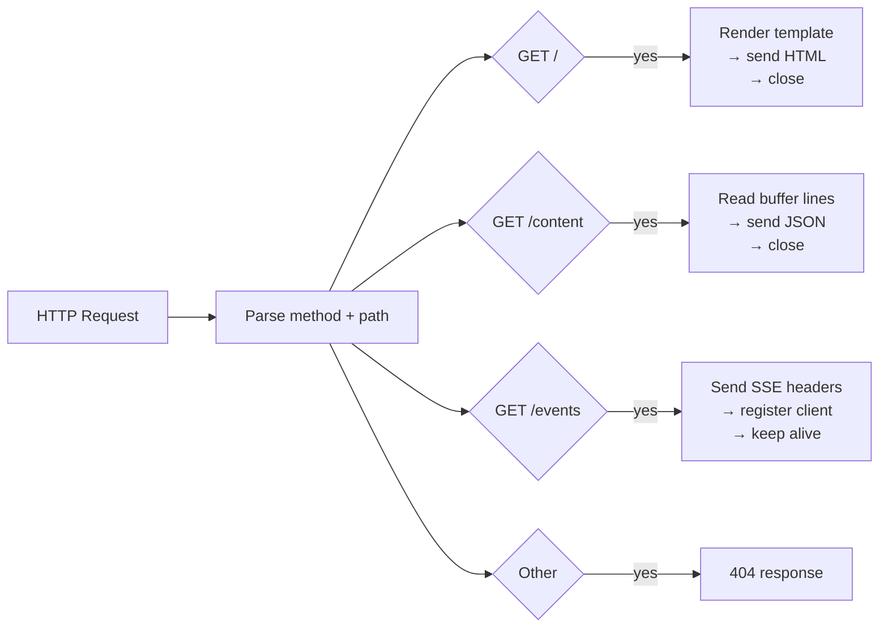
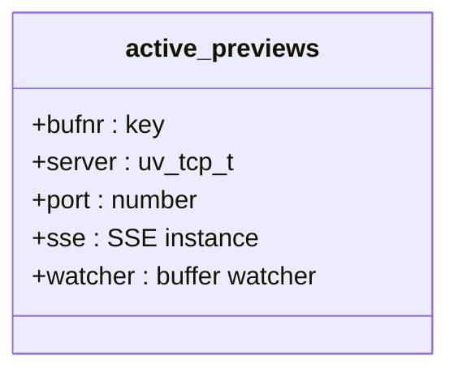
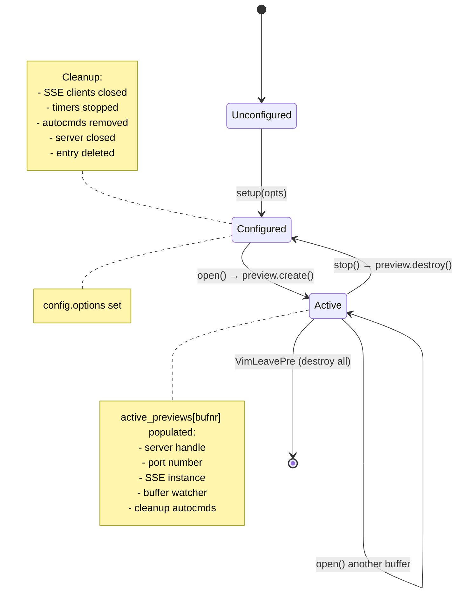

# Architecture

## Overview

md-view.nvim is a browser-based markdown preview plugin for Neovim. It runs a local HTTP server inside Neovim using libuv TCP bindings, serves an HTML page that renders markdown with mermaid diagrams, and pushes live updates over Server-Sent Events (SSE) as the buffer changes.

There are no external runtime dependencies — the server is pure Lua running on Neovim's built-in libuv event loop, and the browser handles all rendering via CDN-loaded JavaScript libraries.

## Project Structure

```
md-view.nvim/
├── plugin/
│   └── md-view.lua              # User command registration
└── lua/md-view/
    ├── init.lua                  # Public API facade: setup(), open(), stop(), toggle(), list()
    ├── config.lua                # Defaults + merge via tbl_deep_extend
    ├── preview.lua               # Preview lifecycle orchestration (create, destroy, state)
    ├── server.lua                # TCP server (bind, listen, accept)
    ├── router.lua                # HTTP request parsing + route dispatch
    ├── sse.lua                   # SSE connection manager + event fan-out
    ├── buffer.lua                # Buffer autocmds + debounced content/scroll push
    ├── template.lua              # HTML page (markdown-it + mermaid.js + morphdom)
    ├── theme.lua                 # All theme concerns: palettes, defaults, resolve, CSS
    ├── picker.lua                # UI selector for active previews
    └── util.lua                  # Browser opening, debounce, platform detection
```

## Module Dependency Graph



## Data Flow

### 1. Initialization (`:MdView`)



### 2. Browser Initial Load



### 3. Live Update — Content



### 4. Live Update — Scroll Sync



The scroll sync works because markdown-it exposes source map information (line numbers) per token. The template JS hooks into markdown-it's block-level renderer rules (`paragraph_open`, `heading_open`, `blockquote_open`, etc.) to attach `data-source-line` attributes to rendered HTML elements. When a scroll event arrives, the browser finds the element whose `data-source-line` is closest to the cursor line and smoothly scrolls to it.

### 5. Shutdown



## Module Details

### `config.lua`

Stores default options and the merged user configuration. Uses `vim.tbl_deep_extend("force", {}, defaults, opts)` to merge, matching the pattern from bearded-arc.nvim. The `options` field is `nil` until `setup()` is called; `init.open()` calls `setup({})` as a fallback if the user never called it explicitly.

### `server.lua`

Creates a TCP server using `vim.uv` (Neovim 0.10+) or `vim.loop` (Neovim 0.8–0.9). Binds to the configured host and port (default port 0 for OS auto-assignment), resolves the actual port via `getsockname()`, and returns both the server handle and port number.

On each incoming connection, it accepts the client socket, accumulates data until a complete HTTP request is received (detected by `\r\n\r\n`), then calls the `on_request` callback on the main thread via `vim.schedule()`.

### `router.lua`

Parses raw HTTP requests (extracts method and path from the first line) and dispatches to route handlers:



Regular responses include `Content-Length` and `Connection: close`. The SSE endpoint sends `Content-Type: text/event-stream` with `Connection: keep-alive` and leaves the socket open for streaming.

### `sse.lua`

A simple connection manager that holds a list of open client sockets. Provides:

- `add_client(client)` — registers a new SSE connection
- `push(event_type, data)` — writes a named SSE event to all clients; dead clients (write errors caught via `pcall`) are removed and closed
- `remove_client(client)` — removes and closes a specific client
- `close_all()` — shuts down all connections

Named SSE events (`content` and `scroll`) allow the browser to handle each type independently via `source.addEventListener(type, ...)`.

### `template.lua`

Returns a self-contained HTML string via `string.format()`, injecting custom CSS and the mermaid theme. The HTML page loads three CDN libraries:

| Library      | Version | Purpose                        |
|--------------|---------|--------------------------------|
| markdown-it  | 14.x    | Markdown → HTML parsing        |
| mermaid.js   | 11.x    | Mermaid → SVG rendering        |
| morphdom     | 2.x     | Efficient DOM diffing/patching |

The embedded JavaScript:

1. Initializes mermaid with `startOnLoad: false` (manual rendering control)
2. Configures markdown-it with a custom fence rule that wraps mermaid blocks in `<pre class="mermaid">` elements
3. Hooks block-level renderer rules to add `data-source-line` attributes for scroll sync
4. Fetches `/content` on initial load to render the current buffer state
5. Opens an `EventSource` to `/events` with two named listeners:
   - `content` — re-renders markdown via morphdom DOM patching, then runs mermaid
   - `scroll` — finds the nearest element by `data-source-line` and calls `scrollIntoView()`

The page uses a dark GitHub-style theme (background `#0d1117`, text `#c9d1d9`).

### `buffer.lua`

Attaches Neovim autocmds to a buffer with two separate debounce timers:

- **Content changes** (`TextChanged`, `TextChangedI`, `BufWritePost`) — debounced at the configured `debounce_ms` (default 300ms). When the timer fires, reads all buffer lines and calls `callbacks.on_content(lines)`.
- **Cursor movement** (`CursorMoved`, `CursorMovedI`) — debounced at 50ms (fast, since scroll sync should feel responsive). Reads the cursor position via `nvim_win_get_cursor()` and calls `callbacks.on_scroll(line)` with a 0-indexed line number.

Returns a table with a `stop()` function that closes both timers and deletes the augroup.

### `util.lua`

- **`open_browser(url, browser)`** — if `browser` is set, uses it directly. Otherwise auto-detects the platform: `open` (macOS), `wslview` (WSL), `xdg-open` (Linux), `cmd /c start` (Windows). Launches detached via `vim.fn.jobstart`.
- **`debounce(fn, ms)`** — creates a debounced wrapper using a `uv.new_timer()`. Each call resets the timer; the function fires `ms` milliseconds after the last call, scheduled back to the main thread via `vim.schedule()`. The returned wrapper has a `.stop()` method to close the timer for cleanup.

### `init.lua`

A thin API facade that delegates to `config` and `preview`:

- **`setup(opts)`** — delegates to `config.setup()`
- **`open()`** — delegates to `preview.create(config.options)`
- **`stop(bufnr)`** — delegates to `preview.destroy(bufnr)`
- **`toggle()`** — checks `preview.get(bufnr)` then opens or stops
- **`list()`** — opens the picker UI
- **`get_active_previews()`** — returns `preview.get_active()`

### `preview.lua`

The orchestration module. Manages the `active_previews` table (keyed by buffer number) which tracks all running preview instances:



- **`create(opts)`** — resolves theme via `theme.resolve()`, creates SSE instance, starts server, attaches buffer watcher, opens browser, registers cleanup autocmds for `BufDelete`/`BufWipeout`/`VimLeavePre`
- **`destroy(bufnr)`** — tears down everything for a buffer: closes SSE clients, stops watcher, stops server, removes from table
- **`get(bufnr)`** — returns the preview entry for a buffer
- **`get_active()`** — returns the full active_previews table

### `plugin/md-view.lua`

Registers three user commands (`:MdView`, `:MdViewStop`, `:MdViewToggle`) that lazy-load the plugin via `require("md-view")`.

## Design Decisions

| Decision | Choice | Rationale |
|----------|--------|-----------|
| Transport | SSE over WebSocket | Simpler protocol, browser-native auto-reconnect via EventSource, unidirectional push is sufficient |
| Rendering | Client-side via CDN | Zero bundling, no build step, browser handles all heavy lifting |
| Port allocation | OS auto-assign (port 0) | No conflicts when multiple buffers run previews simultaneously |
| Update strategy | Full content replace | Simple and correct for v1; incremental diffing is a future optimization |
| One server per buffer | Yes | Clean isolation, no multiplexing complexity |
| DOM patching | morphdom | Preserves mermaid SVG state between updates, avoids full re-render flicker |
| libuv compatibility | `vim.uv or vim.loop` | Works across Neovim 0.8+ (vim.loop) and 0.10+ (vim.uv) |
| Scroll sync | `data-source-line` attributes | markdown-it exposes source map (line numbers) per token; cheap to attach as data attributes during rendering |
| SSE event types | Named events (`content`, `scroll`) | Separates concerns cleanly; browser handles each independently without parsing a type field |
| Debounce | Two timers (300ms content, 50ms scroll) | Content updates are heavier (full re-render), cursor updates should feel immediate |

## HTTP Protocol

The server implements a minimal subset of HTTP/1.1 — enough for browser communication:

- Parses the first line of the request for method and path
- Sends proper status lines, Content-Type, and Content-Length headers
- SSE connections use `text/event-stream` with `Connection: keep-alive`
- Regular responses use `Connection: close` and shut down the socket after sending
- All responses include `Access-Control-Allow-Origin: *` for CORS

## State Lifecycle



## Browser Dependencies (CDN)

| Library      | CDN URL                                                     |
|--------------|-------------------------------------------------------------|
| markdown-it  | `https://cdn.jsdelivr.net/npm/markdown-it@14/dist/markdown-it.min.js` |
| mermaid.js   | `https://cdn.jsdelivr.net/npm/mermaid@11/dist/mermaid.min.js` |
| morphdom     | `https://cdn.jsdelivr.net/npm/morphdom@2/dist/morphdom-umd.min.js` |

## Future Roadmap (Out of Scope for v1)

- LaTeX/KaTeX math equation support
- Custom themes (dark/light toggle, theme CSS files)
- Offline mode (bundled JS dependencies instead of CDN)
