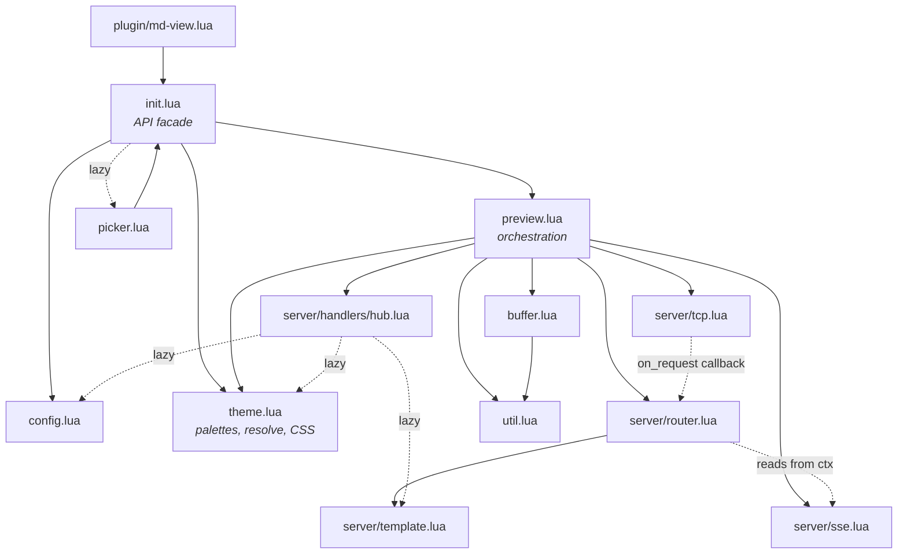
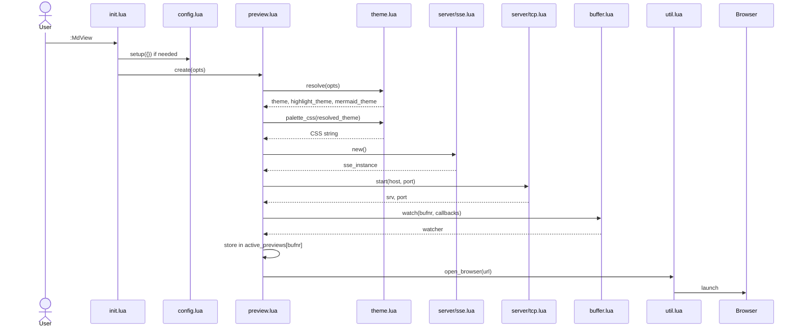
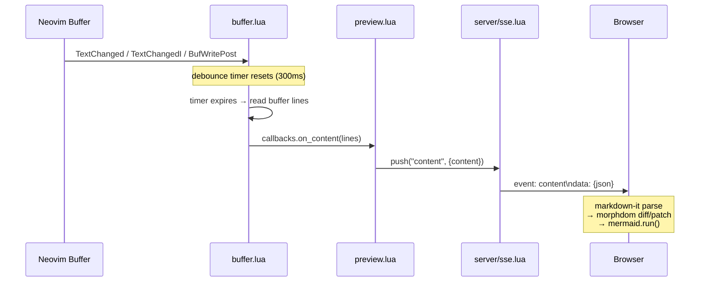
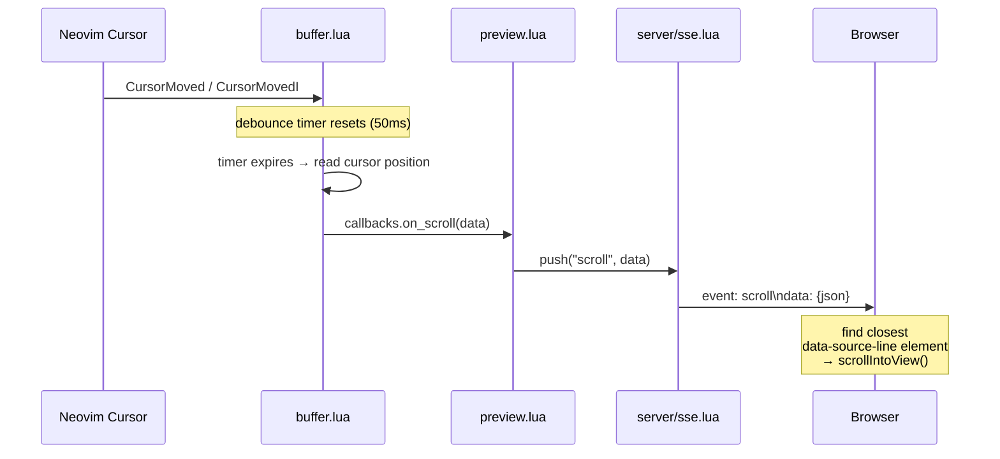
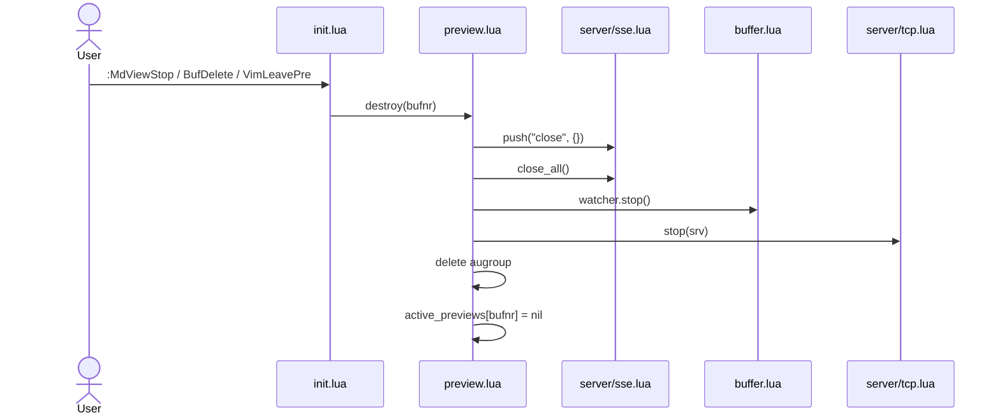
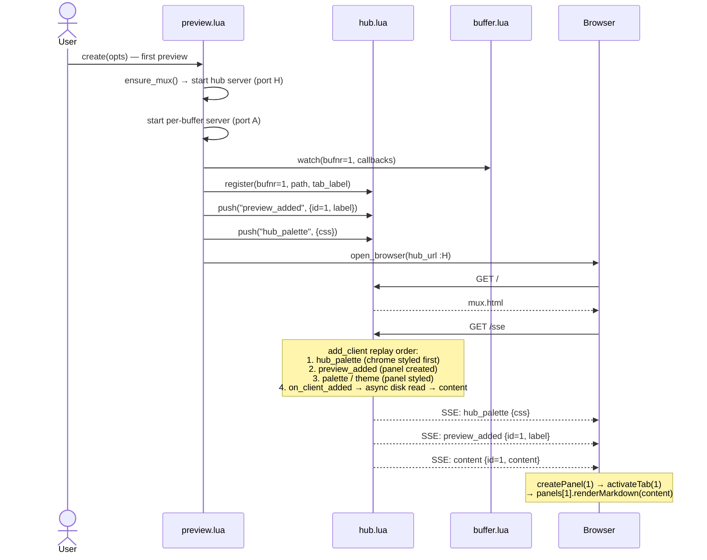
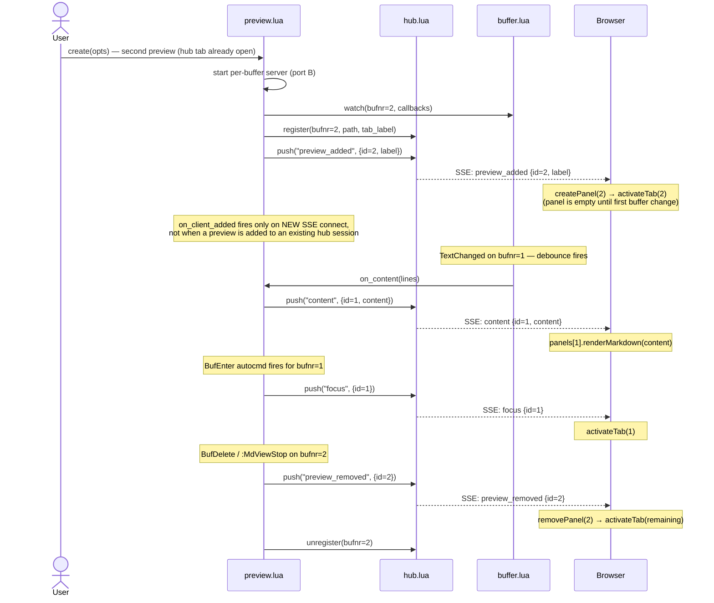
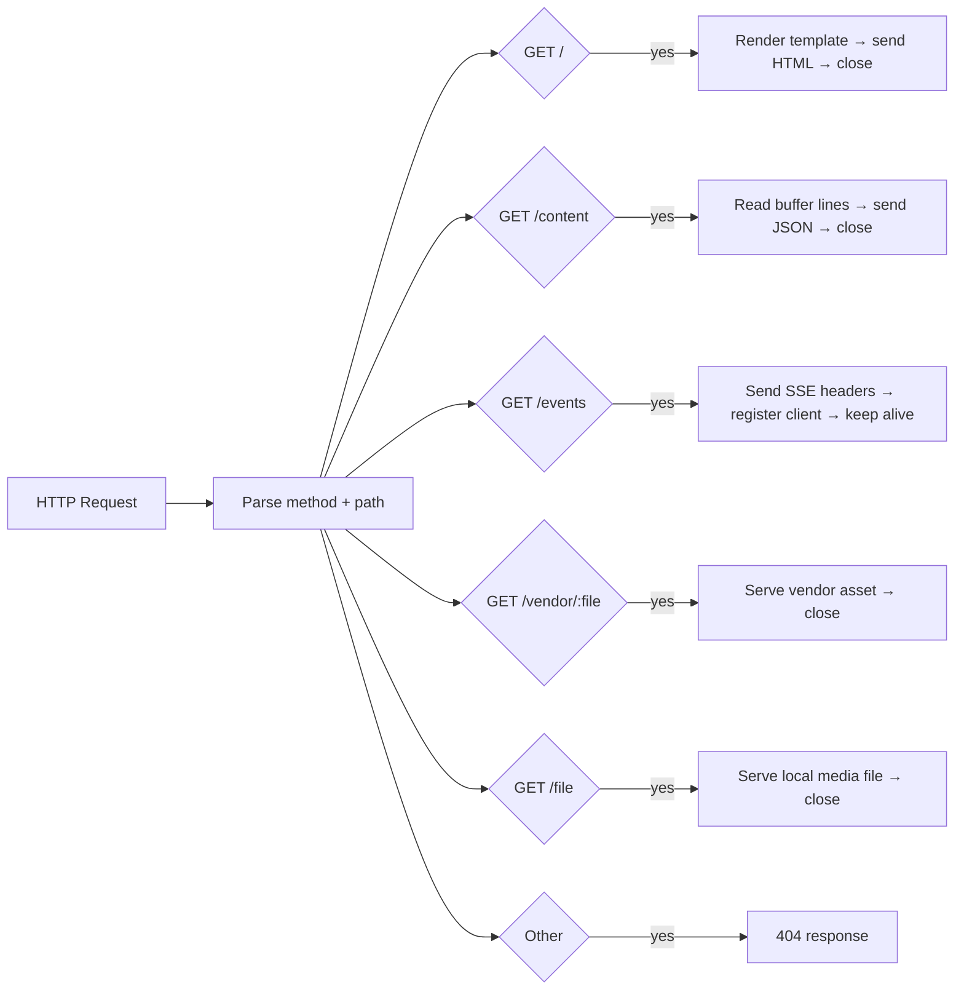
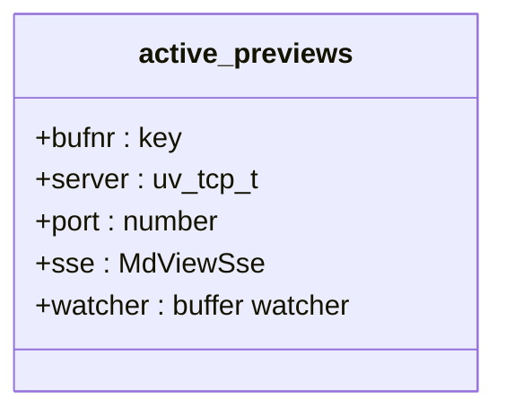
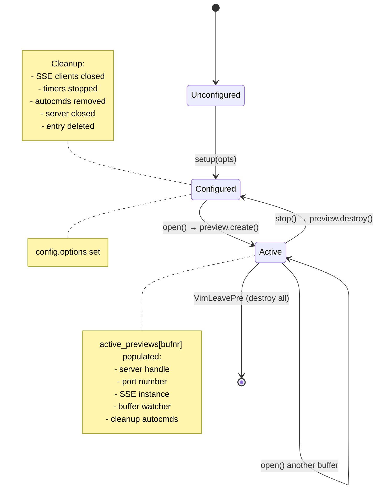

# Architecture

## Overview

md-view.nvim is a browser-based markdown preview plugin for Neovim. It runs a local HTTP server inside Neovim using libuv TCP bindings, serves an HTML page that renders markdown with mermaid diagrams, and pushes live updates over Server-Sent Events (SSE) as the buffer changes.

There are no external runtime dependencies — the server is pure Lua running on Neovim's built-in libuv event loop, and the browser handles all rendering via CDN-loaded JavaScript libraries.

## Project Structure

```
md-view.nvim/
├── plugin/
│   └── md-view.lua              # User command registration
└── lua/md-view/
    ├── init.lua                  # Public API facade: setup(), open(), stop(), toggle(), list()
    ├── config.lua                # Defaults + merge via tbl_deep_extend
    ├── preview.lua               # Preview lifecycle orchestration (create, destroy, state)
    ├── buffer.lua                # Buffer autocmds + debounced content/scroll push
    ├── theme.lua                 # All theme concerns: palettes, defaults, resolve, CSS
    ├── picker.lua                # UI selector for active previews
    ├── util.lua                  # Browser opening, debounce, platform detection
    └── server/
        ├── tcp.lua               # TCP server (bind, listen, accept)
        ├── router.lua            # HTTP request parsing + route dispatch
        ├── sse.lua               # SSE connection manager + event fan-out
        └── template.lua          # HTML page (markdown-it + mermaid.js + morphdom)
```

## Module Dependency Graph



## Data Flow

### 1. Initialization (`:MdView`)



### 2. Browser Initial Load

```mermaid
sequenceDiagram
    participant Browser
    participant router as server/router.lua
    participant template as server/template.lua
    participant preview as preview.lua
    participant sse as server/sse.lua

    Browser->>router: GET /
    router->>template: render(opts, filename)
    template-->>router: HTML
    router-->>Browser: HTML response

    Browser->>router: GET /events
    Note over router: sse_upgrade: write SSE headers first,<br/>then add_client
    router-->>Browser: SSE headers (keep-alive)
    router->>sse: add_client(socket)
    Note over sse: replay last events (theme, palette)<br/>then call on_client_added hook
    sse->>preview: on_client_added(client)
    preview->>preview: read_content_async(bufnr)
    Note over preview: buffer if modified;<br/>disk read otherwise
    preview-->>Browser: SSE: content {content}

    Note over Browser: markdown-it parse<br/>→ morphdom patch DOM<br/>→ mermaid.run()
```

### 3. Live Update — Content



### 4. Live Update — Scroll Sync



The scroll sync works because markdown-it exposes source map information (line numbers) per token. The template JS hooks into markdown-it's block-level renderer rules (`paragraph_open`, `heading_open`, `blockquote_open`, etc.) to attach `data-source-line` attributes to rendered HTML elements. When a scroll event arrives, the browser finds the element whose `data-source-line` is closest to the cursor line and smoothly scrolls to it.

### 5. Shutdown



### 6. Single-Page Mode — Hub Connect

When `single_page.enable = true`, all previews share one browser tab served by a central hub server. The hub replays state to new SSE clients in a fixed order so panels exist before content and styles arrive.



### 7. Single-Page Mode — Second Preview and Live Updates



## Design Decisions

| Decision | Choice | Rationale |
|----------|--------|-----------|
| Transport | SSE over WebSocket | Simpler protocol, browser-native auto-reconnect via EventSource, unidirectional push is sufficient |
| Rendering | Client-side via CDN | Zero bundling, no build step, browser handles all heavy lifting |
| Port allocation | OS auto-assign (port 0) | No conflicts when multiple buffers run previews simultaneously |
| Update strategy | Full content replace | Simple and correct for v1; incremental diffing is a future optimization |
| One server per buffer | Yes | Each preview gets its own TCP socket and port. The resource cost is negligible at loopback scale (one OS file descriptor, a few KB of kernel memory, no extra threads — all I/O runs on Neovim's existing libuv event loop). Typical usage is 1–3 simultaneous previews. The alternative — a single shared server with path-based routing per bufnr — would save nothing measurable while adding multiplexing complexity and shared failure surface. Isolation also means each preview's URL is stable and closing one cannot affect others. |
| DOM patching | morphdom | Preserves mermaid SVG state between updates, avoids full re-render flicker |
| libuv compatibility | `vim.uv or vim.loop` | Works across Neovim 0.8+ (vim.loop) and 0.10+ (vim.uv) |
| Scroll sync | `data-source-line` attributes | markdown-it exposes source map (line numbers) per token; cheap to attach as data attributes during rendering |
| SSE event types | Named events (`content`, `scroll`) | Separates concerns cleanly; browser handles each independently without parsing a type field |
| Debounce | Two timers (300ms content, 50ms scroll) | Content updates are heavier (full re-render), cursor updates should feel immediate |
| Picker UI | `vim.ui.select` | Picker-agnostic by design — any replacement (Telescope, fzf-lua, snacks, dressing.nvim) automatically works. No plugin-specific configuration is exposed; customization is limited to the standardised `vim.ui.select` opts (`prompt`, `format_item`, `kind`) |

## HTTP Protocol

The server implements a minimal subset of HTTP/1.1. Regular responses use `Connection: close`; the SSE endpoint uses `text/event-stream` with `Connection: keep-alive` and stays open for streaming. No CORS headers — loopback-only binding makes same-origin the only origin.



## State Lifecycle

Each active preview is tracked in `active_previews` keyed by buffer number:





## Browser Dependencies (CDN)

| Library      | CDN URL                                                     |
|--------------|-------------------------------------------------------------|
| markdown-it  | `https://cdn.jsdelivr.net/npm/markdown-it@14/dist/markdown-it.min.js` |
| mermaid.js   | `https://cdn.jsdelivr.net/npm/mermaid@11/dist/mermaid.min.js` |
| morphdom     | `https://cdn.jsdelivr.net/npm/morphdom@2/dist/morphdom-umd.min.js` |
| KaTeX        | `https://cdn.jsdelivr.net/npm/katex@0.16.38/dist/katex.min.js` |
| texmath      | `https://cdn.jsdelivr.net/npm/markdown-it-texmath@1.0.0/texmath.js` |
| @viz-js/viz  | `https://cdn.jsdelivr.net/npm/@viz-js/viz@3.25.0/dist/viz-global.js` |
| WaveDrom     | `https://cdn.jsdelivr.net/npm/wavedrom@3.5.0/wavedrom.min.js` |
| graphre      | `https://cdn.jsdelivr.net/npm/graphre@0.1.3/dist/graphre.js` |
| Nomnoml      | `https://cdn.jsdelivr.net/npm/nomnoml@1.6.2/dist/nomnoml.min.js` |
| abcjs        | `https://cdn.jsdelivr.net/npm/abcjs@6.4.4/dist/abcjs-basic-min.js` |
| Vega         | `https://cdn.jsdelivr.net/npm/vega@5.30.0/build/vega.min.js` |
| Vega-Lite    | `https://cdn.jsdelivr.net/npm/vega-lite@5.21.0/build/vega-lite.min.js` |
| Vega-Embed   | `https://cdn.jsdelivr.net/npm/vega-embed@6.26.0/build/vega-embed.min.js` |

