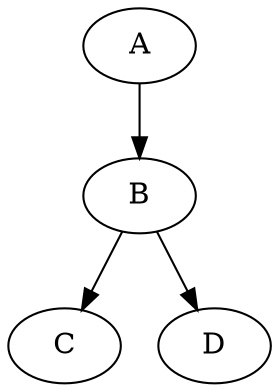
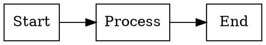
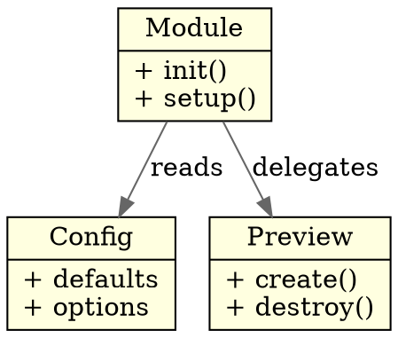
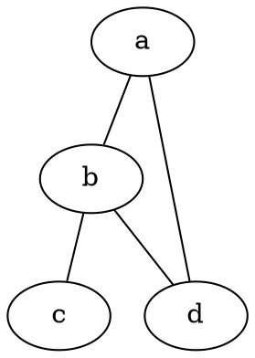
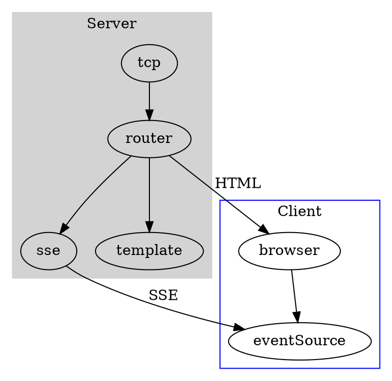

# Graphviz/DOT Test

## Simple Directed Graph

```dot
digraph G {
    A -> B -> C;
    B -> D;
}
```

## Using `graphviz` Fence

```graphviz
digraph {
    rankdir=LR;
    node [shape=box];
    Start -> Process -> End;
}
```

## Styled Graph

```dot
digraph G {
    node [shape=record, style=filled, fillcolor=lightyellow];
    edge [color=gray40];

    struct1 [label="{Module|+ init()\l+ setup()\l}"];
    struct2 [label="{Config|+ defaults\l+ options\l}"];
    struct3 [label="{Preview|+ create()\l+ destroy()\l}"];

    struct1 -> struct2 [label="reads"];
    struct1 -> struct3 [label="delegates"];
}
```

## Undirected Graph

```dot
graph {
    a -- b -- c;
    b -- d;
    a -- d;
}
```

## Subgraphs and Clusters

```dot
digraph G {
    subgraph cluster_0 {
        style=filled;
        color=lightgrey;
        label="Server";
        tcp -> router -> sse;
        router -> template;
    }

    subgraph cluster_1 {
        label="Client";
        color=blue;
        browser -> eventSource;
    }

    router -> browser [label="HTML"];
    sse -> eventSource [label="SSE"];
}
```
