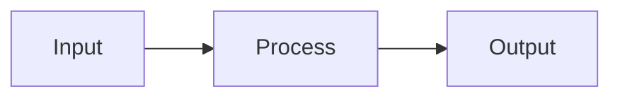
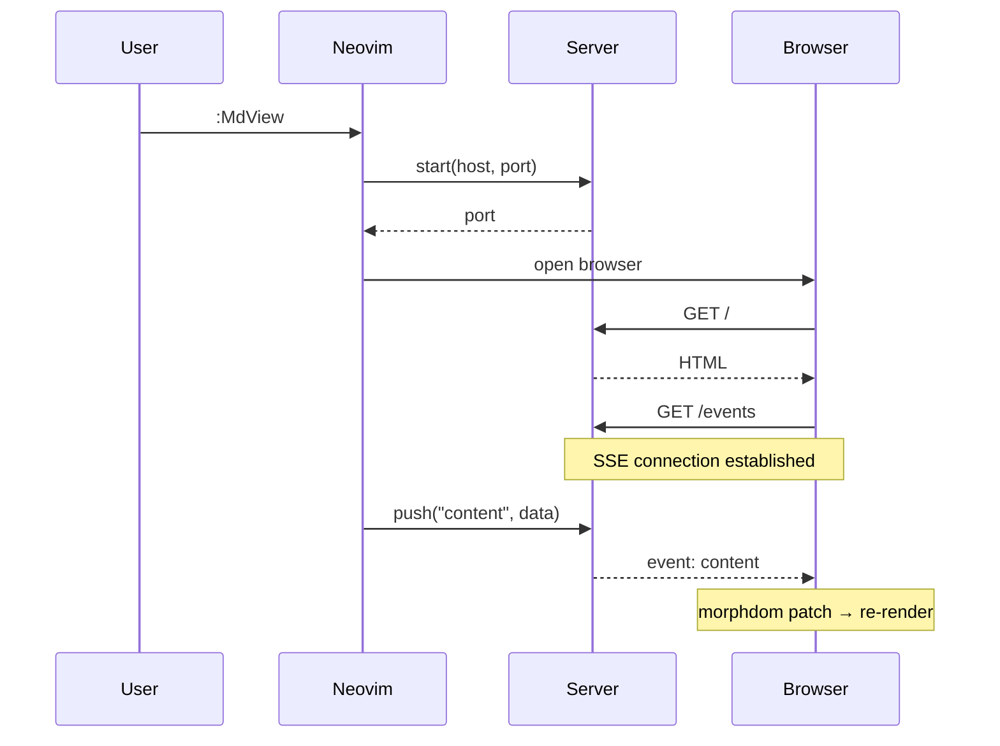
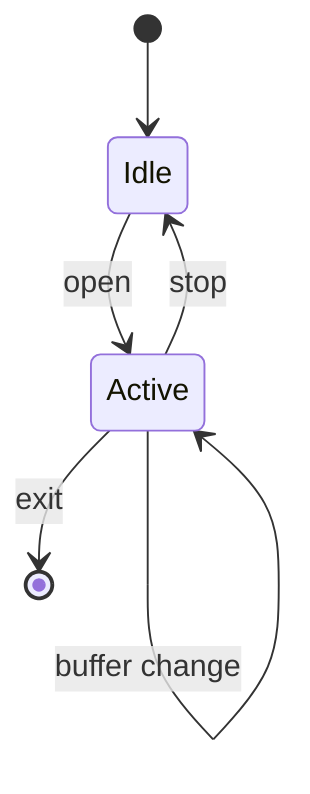
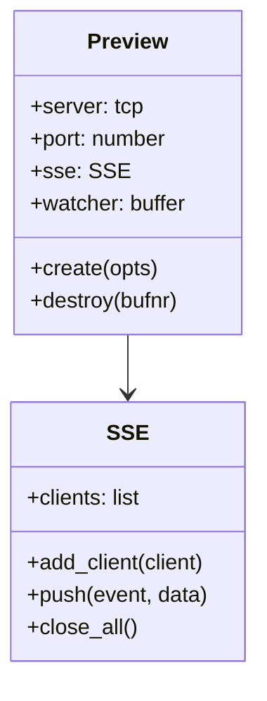
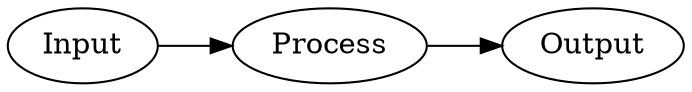
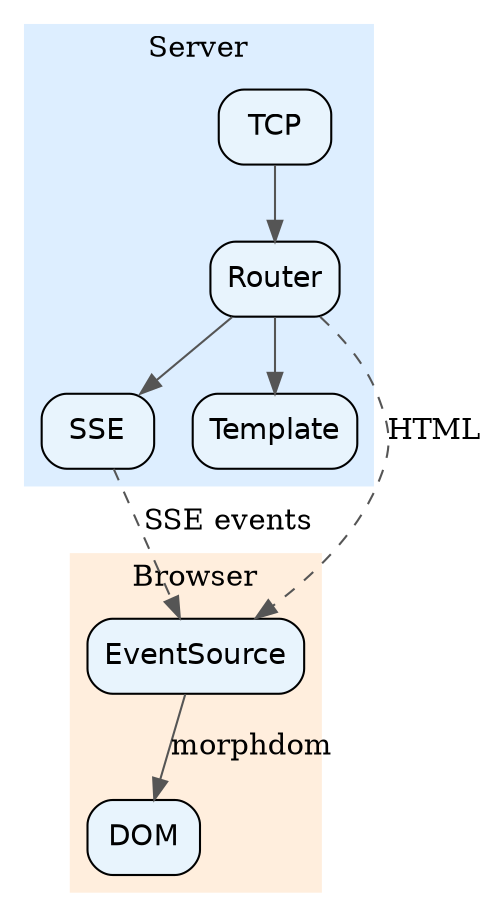
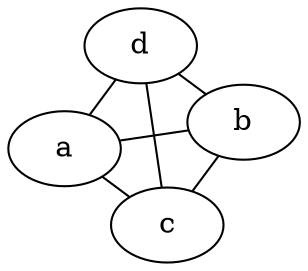

# Kitchen Sink Test

This file exercises every supported markdown feature in a single document.

## Text Formatting

Regular paragraph with **bold**, *italic*, ***bold italic***, `inline code`, and ~~strikethrough~~.

## Links and Images

Visit [GitHub](https://github.com) or see this image:


## Blockquote

> "Any sufficiently advanced technology is indistinguishable from magic."
> — Arthur C. Clarke

## Lists

- Unordered item
  - Nested item
- [x] Task done
- [ ] Task pending

1. First
2. Second
3. Third

## Code

```lua
local function hello()
  print("Hello from the kitchen sink!")
end
```

## Table

| Feature     | Tested |
|-------------|--------|
| Headings    | Yes    |
| Lists       | Yes    |
| Code        | Yes    |
| Tables      | Yes    |
| Mermaid     | Yes    |
| Math/KaTeX  | Yes    |
| Graphviz    | Yes    |
| WaveDrom    | Yes    |
| Nomnoml     | Yes    |
| abcjs       | Yes    |
| Vega-Lite   | Yes    |

---

## Mermaid Diagram

Simple flowchart:



Sequence diagram:



State diagram:



Class diagram:



## Math (KaTeX)

Inline: $E = mc^2$ and $\sum_{i=1}^{n} i = \frac{n(n+1)}{2}$.

Display:

$$
\oint_C \vec{F} \cdot d\vec{r} = \iint_S (\nabla \times \vec{F}) \cdot d\vec{S}
$$

Fenced:

```math
\mathcal{L} = \int \left( \frac{1}{2} \partial_\mu \phi \partial^\mu \phi - V(\phi) \right) d^4x
```

## Graphviz/DOT Diagram

Simple:



Styled with clusters:



Using `graphviz` fence alias:



## WaveDrom Timing Diagram

Simple clock:

```wavedrom
{ "signal": [{ "name": "clk", "wave": "p......" }, { "name": "data", "wave": "x.345x.", "data": ["a", "b", "c"] }] }
```

Bus protocol:

```wavedrom
{ "signal": [
  { "name": "clk",   "wave": "p..Pp..P" },
  { "name": "addr",  "wave": "x..3.x..", "data": ["A1"] },
  { "name": "wr",    "wave": "0..1..0." },
  { "name": "data",  "wave": "x..3..x.", "data": ["D1"] },
  { "name": "ack",   "wave": "0....10." }
] }
```

Signal groups:

```wavedrom
{ "signal": [
  ["Master",
    { "name": "clk",  "wave": "p...." },
    { "name": "req",  "wave": "01..0" }
  ],
  ["Slave",
    { "name": "ack",  "wave": "0.1.0" },
    { "name": "data", "wave": "x.34x", "data": ["D0", "D1"] }
  ]
] }
```

## Nomnoml UML Diagram

Simple association:

```nomnoml
[User] -> [Service]
[Service] -> [Database]
```

Class diagram:

```nomnoml
[Customer|name: string;email: string|getOrders();updateProfile()]
[Order|id: int;total: float|cancel();refund()]
[Customer] 1 -> * [Order]
```

Package with inheritance:

```nomnoml
#direction: right

[<abstract>Shape|area(): float]
[<actor>User]
[Shape] <:- [Circle|radius: float]
[Shape] <:- [Rectangle|width: float;height: float]
[User] -> [Shape]

[<package>MVC|
  [Controller] -> [Model]
  [Controller] -> [View]
  [Model] <- [View]
]
```

## ABC Music

Simple scale:

```abc
X:1
T:Simple Scale
M:4/4
K:C
CDEF GABc|
```

Twinkle Twinkle:

```abc
X:2
T:Twinkle Twinkle Little Star
M:4/4
L:1/4
K:C
CC GG|AA G2|FF EE|DD C2|
GG FF|EE D2|GG FF|EE D2|
CC GG|AA G2|FF EE|DD C2|
```

## Vega-Lite Chart

Bar chart:

```vega-lite
{
  "$schema": "https://vega.github.io/schema/vega-lite/v5.json",
  "data": {"values": [{"a": "A", "b": 28}, {"a": "B", "b": 55}, {"a": "C", "b": 43}]},
  "mark": "bar",
  "encoding": {
    "x": {"field": "a", "type": "nominal"},
    "y": {"field": "b", "type": "quantitative"}
  }
}
```

Scatter plot with size encoding:

```vega-lite
{
  "$schema": "https://vega.github.io/schema/vega-lite/v5.json",
  "data": {
    "values": [
      {"x": 1, "y": 3, "size": 10},
      {"x": 2, "y": 7, "size": 20},
      {"x": 3, "y": 5, "size": 15},
      {"x": 4, "y": 8, "size": 25},
      {"x": 5, "y": 6, "size": 30}
    ]
  },
  "mark": "point",
  "encoding": {
    "x": {"field": "x", "type": "quantitative"},
    "y": {"field": "y", "type": "quantitative"},
    "size": {"field": "size", "type": "quantitative"}
  }
}
```

Line chart:

```vega-lite
{
  "$schema": "https://vega.github.io/schema/vega-lite/v5.json",
  "data": {"values": [{"x": 1, "y": 2}, {"x": 2, "y": 4}, {"x": 3, "y": 3}, {"x": 4, "y": 7}, {"x": 5, "y": 5}]},
  "mark": "line",
  "encoding": {
    "x": {"field": "x", "type": "quantitative"},
    "y": {"field": "y", "type": "quantitative"}
  }
}
```

## Deeply Nested Content

> Blockquote with:
>
> - A list
>   - With nesting
>     - And deeper nesting
>
> And a code block:
>
> ```
> nested code
> ```

---

*End of kitchen sink test.*
