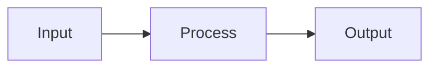

# Kitchen Sink Test

This file exercises every supported markdown feature in a single document.

## Text Formatting

Regular paragraph with **bold**, *italic*, ***bold italic***, `inline code`, and ~~strikethrough~~.

## Links and Images

Visit [GitHub](https://github.com) or see this image:


## Blockquote

> "Any sufficiently advanced technology is indistinguishable from magic."
> — Arthur C. Clarke

## Lists

- Unordered item
  - Nested item
- [x] Task done
- [ ] Task pending

1. First
2. Second
3. Third

## Code

```lua
local function hello()
  print("Hello from the kitchen sink!")
end
```

## Table

| Feature     | Tested |
|-------------|--------|
| Headings    | Yes    |
| Lists       | Yes    |
| Code        | Yes    |
| Tables      | Yes    |
| Mermaid     | Yes    |

---

## Mermaid Diagram



## Deeply Nested Content

> Blockquote with:
>
> - A list
>   - With nesting
>     - And deeper nesting
>
> And a code block:
>
> ```
> nested code
> ```

---

*End of kitchen sink test.*
