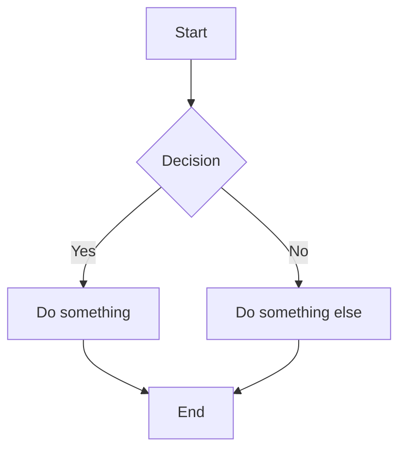
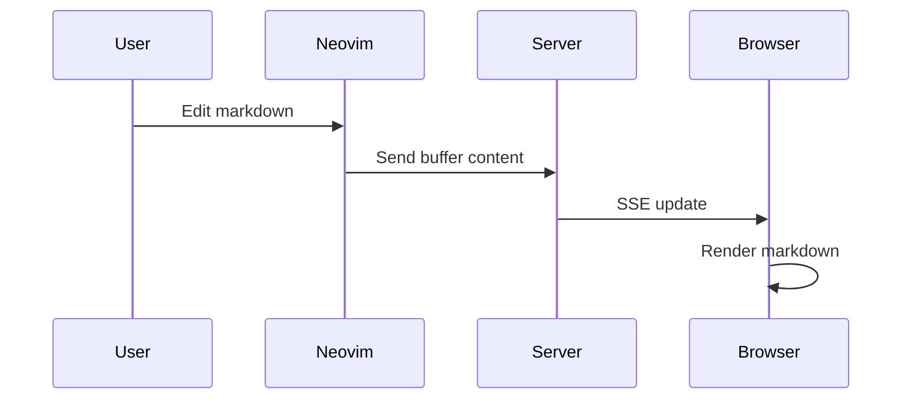
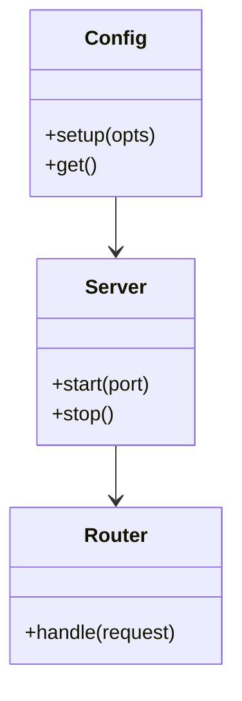
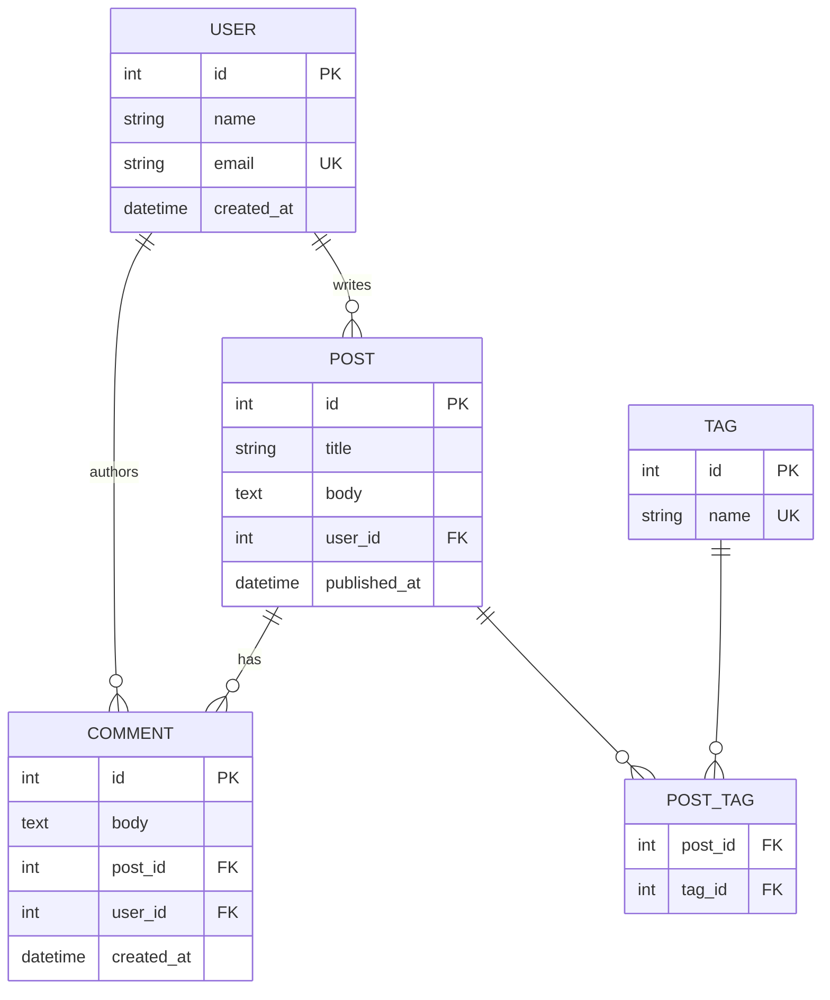
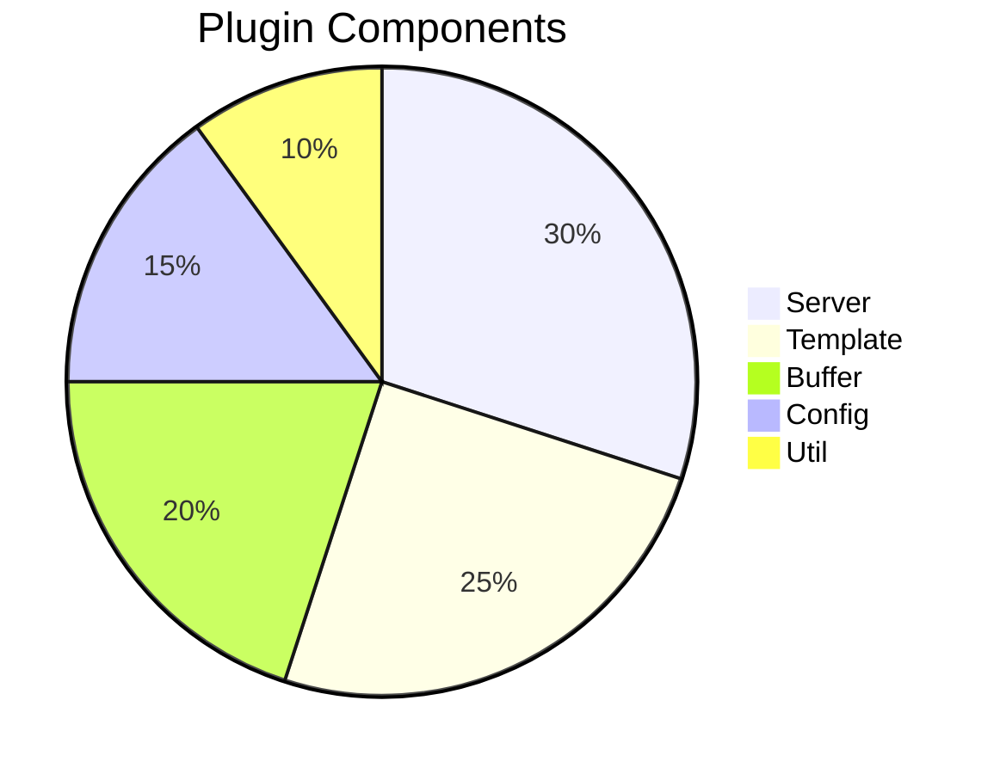

# Mermaid Diagrams

## Flowchart

```mermaid
graph TD
    A[Start] --> B{Decision}
    B -->|Yes| C[Do something]
    B -->|No| D[Do something else]
    C --> E[End]
    D --> E
```

## Sequence Diagram

```mermaid
sequenceDiagram
    participant U as User
    participant N as Neovim
    participant S as Server
    participant B as Browser

    U->>N: Edit markdown
    N->>S: Send buffer content
    S->>B: SSE update
    B->>B: Render markdown
```

## Class Diagram

```mermaid
classDiagram
    class Config {
        +setup(opts)
        +get()
    }
    class Server {
        +start(port)
        +stop()
    }
    class Router {
        +handle(request)
    }
    Config --> Server
    Server --> Router
```

## Entity Relationship Diagram

```mermaid
erDiagram
    USER {
        int id PK
        string name
        string email UK
        datetime created_at
    }
    POST {
        int id PK
        string title
        text body
        int user_id FK
        datetime published_at
    }
    COMMENT {
        int id PK
        text body
        int post_id FK
        int user_id FK
        datetime created_at
    }
    TAG {
        int id PK
        string name UK
    }
    POST_TAG {
        int post_id FK
        int tag_id FK
    }

    USER ||--o{ POST : writes
    USER ||--o{ COMMENT : authors
    POST ||--o{ COMMENT : has
    POST ||--o{ POST_TAG : ""
    TAG ||--o{ POST_TAG : ""
```

## Pie Chart

```mermaid
pie title Plugin Components
    "Server" : 30
    "Template" : 25
    "Buffer" : 20
    "Config" : 15
    "Util" : 10
```
