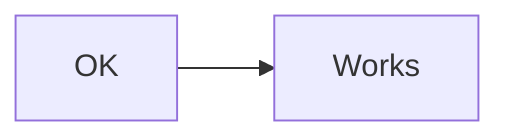
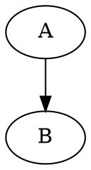

# Notation Error Styling Test

Every notation block below contains intentionally broken syntax. Each should display the raw source with a `.notation-error` left-accent border instead of a rendered diagram.

## Mermaid — invalid syntax

```mermaid
graph LR
    A --> B
    this is not valid mermaid %%%
    C --> [broken
```

## Mermaid — colon conflict (the original bug)

```mermaid
stateDiagram-v2
    [*] --> Idle
    Idle --> :MdView : open
```

## Math (KaTeX) — unclosed group

```math
\frac{1}{2 + \left(
```

## Graphviz/DOT — missing closing brace

```dot
digraph G {
    rankdir=LR;
    A -> B -> C;
```

## WaveDrom — invalid JSON

```wavedrom
{ "signal": [ "name": "clk" "wave": "p...." ] }
```

## Nomnoml — malformed syntax

```nomnoml
[Broken|
  [nested without close
  -> missing target
```

## Vega-Lite — invalid JSON

```vega-lite
{ "mark": "bar", "encoding": { "x": } }
```

## Vega-Lite — valid JSON but missing required fields

```vega-lite
{
  "$schema": "https://vega.github.io/schema/vega-lite/v5.json",
  "mark": "bar"
}
```

---

## Valid blocks (should still render correctly)

### Mermaid (valid)



### Math (valid)

```math
E = mc^2
```

### Graphviz (valid)



### WaveDrom (valid)

```wavedrom
{ "signal": [{ "name": "clk", "wave": "p...." }] }
```

### Nomnoml (valid)

```nomnoml
[Valid] -> [Diagram]
```

### ABC Music (valid)

```abc
X:1
T:Scale
M:4/4
K:C
CDEF GABc|
```

### Vega-Lite (valid)

```vega-lite
{
  "$schema": "https://vega.github.io/schema/vega-lite/v5.json",
  "data": {"values": [{"a": "A", "b": 28}, {"a": "B", "b": 55}]},
  "mark": "bar",
  "encoding": {
    "x": {"field": "a", "type": "nominal"},
    "y": {"field": "b", "type": "quantitative"}
  }
}
```

---

*Broken blocks should show raw source with a red left-border. Valid blocks below should render normally.*
